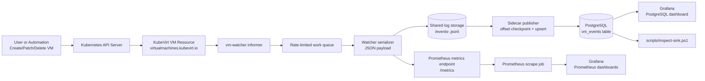
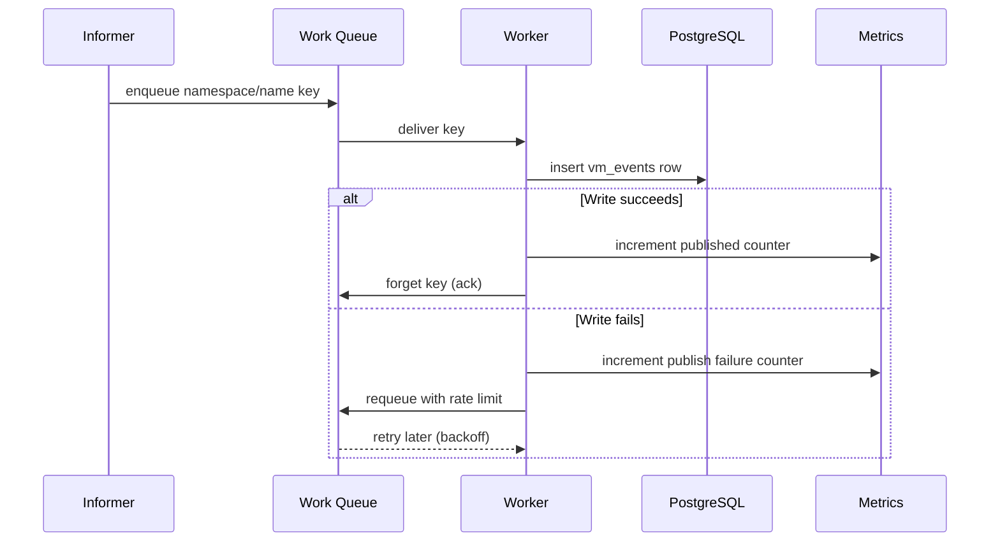

# vm-watcher

KubeVirt VM audit pipeline for OpenShift/Kubernetes: kube-apiserver audit logs flow through Vector into Kafka, and a Go sink stores authoritative VirtualMachine mutations in PostgreSQL with dedupe and manual offset commits.

## What this project includes

- Go audit sink (`cmd/audit-sink`)
- kube-apiserver audit log forwarding via OpenShift `ClusterLogForwarder`
- Strimzi Kafka durable buffer (`vm-audit-raw`)
- PostgreSQL sink (`vm_audit_events` table) via `auditID` dedupe
- Health endpoint (`/healthz`)
- Optional Grafana/Prometheus overlays if you still want them for other workloads

## Prerequisites

- Windows + PowerShell
- Docker Desktop
- `kind`
- `kubectl`
- `kustomize`
- `go` (for local build)

## Quick start

```powershell
.\scripts\setup.ps1
```

This will:

1. Create/reuse kind cluster (`vm-watcher-dev`)
2. Install KubeVirt
3. Install ingress-nginx
4. Build/load `vm-audit-sink:dev`
5. Install Strimzi, deploy PostgreSQL, Kafka, and the audit sink
6. Apply the audit forwarding manifest for OpenShift environments

## Design document

### Architecture

This deployment uses an audit-log write path:

1. kube-apiserver emits authoritative audit events for every mutating VM request.
2. OpenShift `ClusterLogForwarder` forwards the audit stream to Kafka topic `vm-audit-raw`.
3. `cmd/audit-sink` consumes Kafka with manual offset commits and filters for KubeVirt `virtualmachines` events.
4. PostgreSQL enforces global dedupe with `auditID` as the primary key.
5. Kafka provides the durable replay buffer; PostgreSQL remains the queryable store.

### Delivery behavior

- Multiple sink replicas can share the same Kafka consumer group.
- Kafka partitions provide parallelism; one partition is owned by one consumer at a time.
- Manual offset commits happen only after the PostgreSQL insert succeeds.
- Duplicate event rows are prevented in PostgreSQL by `ON CONFLICT (audit_id) DO NOTHING`.

### Low-latency ingest

- Kafka consumer wait bound: `KAFKA_MAX_WAIT` (default `500ms`)
- The sink pre-filters with a cheap byte search before parsing JSON.
- The sink also filters by `objectRef.resource`, `objectRef.apiGroup`, `stage`, and HTTP status.

## PostgreSQL persistence, backup, and restore

### Persistent data volume

PostgreSQL uses a persistent volume claim:

- PVC name: `postgres-data`
- Namespace: `vm-watcher`
- Requested size: `20Gi`

This means PostgreSQL data is not lost when the pod/container restarts.

### Check PVC status

```powershell
kubectl get pvc -n vm-watcher
kubectl describe pvc postgres-data -n vm-watcher
```

### Backup (export)

Use the helper script:

```powershell
.\scripts\backup-postgres.ps1
```

Optional destination:

```powershell
.\scripts\backup-postgres.ps1 -OutputDir .\backups
```

The script creates a PostgreSQL custom-format dump (`.dump`) that you can copy to external storage (NAS/object storage/file share).

### Restore (import)

Use the helper script:

```powershell
.\scripts\restore-postgres.ps1 -BackupFile .\backups\vmwatcher-backup-YYYYMMDD-HHMMSS.dump
```

Restore behavior:

- Uses `pg_restore`
- Includes `--clean --if-exists` to replace existing objects safely

### Scheduled automatic backups (CronJob)

The deployment includes:

- CronJob: `postgres-backup`
- Backup PVC: `postgres-backups`
- Schedule: every 6 hours (`0 */6 * * *`)
- Retention: 7 days (`BACKUP_RETENTION_DAYS`)

Backup verification:

- CronJob: `postgres-backup-verify`
- Schedule: every 6 hours, offset by 30 minutes (`30 */6 * * *`)
- Validates the newest `.dump` backup with `pg_restore --list`

Check backup scheduler state:

```powershell
kubectl get cronjob -n vm-watcher
kubectl get jobs -n vm-watcher
kubectl get pvc postgres-backups -n vm-watcher
```

Run one backup immediately:

```powershell
kubectl create job --from=cronjob/postgres-backup postgres-backup-manual -n vm-watcher
kubectl logs -n vm-watcher job/postgres-backup-manual
```

Run one verification immediately:

```powershell
kubectl create job --from=cronjob/postgres-backup-verify postgres-backup-verify-manual -n vm-watcher
kubectl logs -n vm-watcher job/postgres-backup-verify-manual
```

List files on backup PVC (helper pod):

```powershell
kubectl run backup-shell -n vm-watcher --image=busybox:1.36 --restart=Never --overrides '{"spec":{"volumes":[{"name":"b","persistentVolumeClaim":{"claimName":"postgres-backups"}}],"containers":[{"name":"backup-shell","image":"busybox:1.36","command":["sh","-c","sleep 3600"],"volumeMounts":[{"name":"b","mountPath":"/backups"}]}]}}'
kubectl wait --for=condition=Ready pod/backup-shell -n vm-watcher --timeout=60s
kubectl exec -n vm-watcher backup-shell -- ls -lh /backups
```

Copy one backup file locally:

```powershell
kubectl cp vm-watcher/backup-shell:/backups/vmwatcher-backup-YYYYMMDD-HHMMSS.dump .\backups\
kubectl delete pod backup-shell -n vm-watcher
```

Helper scripts:

```powershell
./scripts/run-postgres-backup-job.ps1
./scripts/run-postgres-backup-verify-job.ps1
```

### Optional one-time in-cluster SQL backup file

```powershell
$pod = kubectl get pod -n vm-watcher -l app=postgres -o jsonpath="{.items[0].metadata.name}"
kubectl exec -n vm-watcher $pod -- sh -lc "pg_dump -U vmwatcher -d vmwatcher > /tmp/vmwatcher.sql"
kubectl cp "vm-watcher/$pod:/tmp/vmwatcher.sql" .\vmwatcher.sql
```

## How watcher works (overview)

The watcher listens for KubeVirt VirtualMachine API events, transforms each event into a JSON payload, and then processes it in two paths:

1. Data path (event persistence): writes each VM event to rotating JSONL files; sidecar publishes into PostgreSQL table `vm_events`
2. Observability path (telemetry): updates Prometheus counters/gauges that Grafana dashboards query

### Event flow diagram



### What gets logged for each event

- Event key: `namespace/name` (for example, `team-a/fedora-testvm`)
- Event type: `ADDED`, `MODIFIED`, or `DELETED`
- VM status (when present): for example `Starting`, `Running`, `Stopping`, `Stopped`
- Timestamp: RFC3339/UTC event timestamp from watcher payload

### Event processing behavior

- Informer receives KubeVirt VM events and enqueues a key
- Worker dequeues keys and fetches current VM object state
- Worker emits JSON payload and writes one row into PostgreSQL
- Worker updates Prometheus metrics for event totals, queue depth, and last seen event time
- Grafana dashboards visualize both live metric trends and persisted SQL history

### Retry and error path (sequence)



## Why this watcher design

This design is strong for VM lifecycle auditing because it separates event collection, durable storage, and observability into independent components.

### Pros

- Durable history: every processed event is stored in PostgreSQL, so dashboards are not only based on volatile time-series data.
- Backpressure handling: rate-limited queue smooths bursts and provides retry/backoff on sink failures.
- Operational visibility: Prometheus metrics expose queue depth, throughput, and failure counts for quick diagnosis.
- Clear integration points: Grafana can query both Prometheus (rates/trends) and PostgreSQL (exact event history).
- Namespace scalability: can watch one, many, or all namespaces without changing core logic.

### Cons

- At-least-once behavior: retries can create duplicate logical updates unless dedupe rules are added downstream.
- Event granularity noise: many `MODIFIED` events can be generated for one VM lifecycle action.
- More moving parts: PostgreSQL + Prometheus + Grafana + ingress adds setup and operational overhead.
- Current model keying: `event_key` groups by `namespace/name` but does not include a unique event id from K8s.
- Postgres sink coupling: code still carries legacy sink logic in some places if not fully cleaned to Postgres-only.

### When this is the better choice

- You need both real-time monitoring and historical auditability.
- You expect intermittent sink failures and want built-in retry with controlled backoff.
- You want simple SQL access for troubleshooting in addition to time-series dashboards.

## Recommended improvements

### 1. Event deduplication strategy

Goal: reduce duplicate logical updates caused by retries or noisy update streams.

- Add a deterministic event fingerprint, for example hash of:
  - `event_key`
  - `payload.type`
  - `payload.status`
  - rounded/normalized event timestamp bucket
- Store fingerprint in PostgreSQL and enforce uniqueness with an index.
- Keep raw payload, but mark duplicates for analytics clarity.

Example index shape:

```sql
alter table vm_events add column if not exists event_fingerprint text;
create unique index if not exists ux_vm_events_fingerprint on vm_events(event_fingerprint);
```

### 2. Idempotent DB insert pattern

Goal: make retries safe and remove duplicate rows from transient sink failures.

- Use PostgreSQL upsert semantics:
  - `INSERT ... ON CONFLICT DO NOTHING`
  - or `ON CONFLICT (...) DO UPDATE` when enriching existing rows
- Track write outcome in metrics:
  - inserted
  - conflict-skipped
  - failed

This keeps queue retry behavior while preventing duplicate persistence.

### 3. MODIFIED event noise filtering

Goal: keep meaningful lifecycle transitions and suppress low-value churn.

- Compare current vs last-seen relevant VM fields only, for example:
  - runStrategy
  - printable status/phase
  - node assignment
  - ready condition
- Ignore updates where only non-essential metadata changed.
- Optionally add debounce window (for example 1-2 seconds per `event_key`) to collapse bursts.

Suggested approach:

- Maintain small in-memory cache keyed by `event_key` with last significant state hash.
- Publish/store only when the significant-state hash changes.
- Expose metric for filtered events (for visibility into suppression rate).

## Access

Add hosts entries (run as Administrator):

```powershell
Add-Content -Path "$env:SystemRoot\System32\drivers\etc\hosts" -Value "127.0.0.1 grafana.local prometheus.local"
```

Open:

- Grafana: `http://grafana.local` (admin/admin)
- Prometheus: `http://prometheus.local`
- Health: `http://localhost:8080/healthz`

If needed on an existing cluster without host port mapping:

```powershell
kubectl port-forward -n ingress-nginx svc/ingress-nginx-controller 80:80
```

## VM examples

### Fedora VM

```powershell
kubectl apply -f .\deployment\05-example-vm.yaml
kubectl patch vm fedora-testvm -n team-a --type=merge -p '{"spec":{"runStrategy":"Always"}}'
```

### Alpine VM

```powershell
kubectl apply -f .\deployment\06-alpine-testvm.yaml
kubectl patch vm alpine-testvm -n team-b --type=merge -p '{"spec":{"runStrategy":"Always"}}'
```

### Windows VM (DataVolume import flow)

1. Set a valid Windows image URL in `deployment/12-example-windows-datavolume.yaml` (or pass `-WindowsImageUrl`).
1. Run:

```powershell
.\scripts\setup.ps1 -CreateWindowsExampleVM $true -CreateWindowsDataVolume $true -WindowsImageUrl "https://YOUR_WINDOWS_IMAGE.qcow2"
```

1. Wait for import:

```powershell
kubectl get dv -n team-b windows-rootdisk -w
```

1. Start VM:

```powershell
kubectl patch vm windows-testvm -n team-b --type=merge -p '{"spec":{"runStrategy":"Always"}}'
```

## Inspect events in PostgreSQL

```powershell
.\scripts\inspect-sink.ps1 -SinkType postgres -Tail 20
```

Direct query:

```powershell
$pod = kubectl get pod -n vm-watcher -l app=postgres -o jsonpath="{.items[0].metadata.name}"
kubectl exec -n vm-watcher $pod -- psql -U vmwatcher -d vmwatcher -c "select id,event_key,payload->>'type' as type,payload->>'status' as status,created_at from vm_events order by id desc limit 20;"
```

## Prometheus metrics exposed by watcher

- `vm_events_observed_total`
- `vm_events_published_total`
- `vm_events_publish_failures_total`
- `vm_events_publish_conflicts_total`
- `vm_events_filtered_total`
- `vm_event_queue_depth`
- `vm_last_event_unix_seconds`

## Dashboards

Grafana folder: **VM Watcher**

- VM Watcher - Lifecycle Overview
- VM Watcher - Per Namespace Changes
- VM Watcher - PostgreSQL Events

## Event consumer (state + transitions + anomaly logic)

This repo now includes a PostgreSQL consumer at `cmd/vm-event-consumer`.

Consumer responsibilities:

- Incremental checkpointing (`consumer_offsets`) so it resumes from the last processed `vm_events.id`
- Idempotent processing (`consumer_processed_events`) keyed by `event_fingerprint`
- VM latest-state projection (`vm_state`) for fast "current status" queries
- Transition history (`vm_state_transitions`) with anomaly flags and reasons
- Backoff/retry loop for transient database issues

### Build and run locally

```powershell
go run .\cmd\vm-event-consumer
```

### Build container and deploy to cluster

```powershell
docker build -f .\Dockerfile.consumer -t vm-event-consumer:dev .
kind load docker-image vm-event-consumer:dev --name vm-watcher-dev
kubectl apply -f .\deployment\13-vm-event-consumer.yaml
kubectl rollout status deployment/vm-event-consumer -n vm-watcher --timeout=120s
kubectl logs -n vm-watcher deploy/vm-event-consumer --tail=100
```

### Useful consumer queries

```sql
-- last consumed offset per consumer
select consumer_name, last_event_id, updated_at
from consumer_offsets;

-- current VM state projection
select event_key, last_status, last_event_type, last_seen_at, total_events
from vm_state
order by updated_at desc;

-- latest transitions and anomalies
select event_key, from_status, to_status, anomaly, reason, transition_at
from vm_state_transitions
order by transition_at desc
limit 50;

-- sidecar offsets (file checkpoint state)
select publisher_id, file_path, offset, updated_at
from vm_log_offsets
order by updated_at desc
limit 50;
```

## Important notes

- This repo is currently Postgres-first for sink usage.
- Windows VM bootability depends on a valid, licensed Windows disk image and successful DataVolume import.
- In nested virtualization-constrained environments, KubeVirt uses emulation mode in setup.
