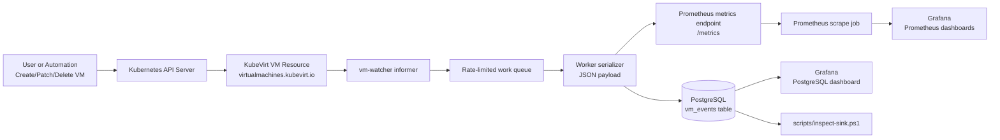
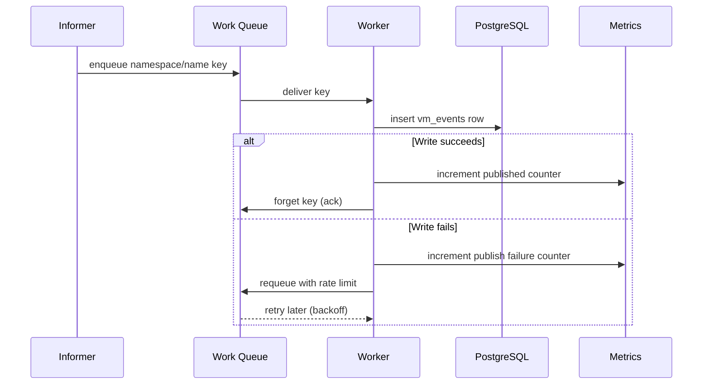

# vm-watcher

KubeVirt VM event watcher for Kubernetes that publishes VM lifecycle events to PostgreSQL and exposes Prometheus metrics.

## What this project includes

- Go watcher service (KubeVirt VirtualMachine watch)
- PostgreSQL sink (`vm_events` table)
- Prometheus metrics endpoint (`/metrics`)
- Grafana dashboards (Prometheus + PostgreSQL datasources)
- NGINX ingress routing for local access:
  - `http://grafana.local`
  - `http://prometheus.local`
- Example VMs:
  - Fedora VM (`team-a`)
  - Alpine VM (`team-b`)
  - Windows VM template (`team-b`)

## Prerequisites

- Windows + PowerShell
- Docker Desktop
- `kind`
- `kubectl`
- `kustomize`
- `go` (for local build)

## Quick start

```powershell
.\scripts\setup.ps1
```

This will:

1. Create/reuse kind cluster (`vm-watcher-dev`)
2. Install KubeVirt
3. Install ingress-nginx
4. Build/load `vm-watcher:dev`
5. Deploy PostgreSQL, vm-watcher, Prometheus, Grafana, and Ingress
6. Apply Fedora example VM (default)

## How watcher works (overview)

The watcher listens for KubeVirt VirtualMachine API events, transforms each event into a JSON payload, and then processes it in two paths:

1. Data path (event persistence): writes each VM event to PostgreSQL table `vm_events`
2. Observability path (telemetry): updates Prometheus counters/gauges that Grafana dashboards query

### Event flow diagram



### What gets logged for each event

- Event key: `namespace/name` (for example, `team-a/fedora-testvm`)
- Event type: `ADDED`, `MODIFIED`, or `DELETED`
- VM status (when present): for example `Starting`, `Running`, `Stopping`, `Stopped`
- Timestamp: RFC3339/UTC event timestamp from watcher payload

### Event processing behavior

- Informer receives KubeVirt VM events and enqueues a key
- Worker dequeues keys and fetches current VM object state
- Worker emits JSON payload and writes one row into PostgreSQL
- Worker updates Prometheus metrics for event totals, queue depth, and last seen event time
- Grafana dashboards visualize both live metric trends and persisted SQL history

### Retry and error path (sequence)



## Why this watcher design

This design is strong for VM lifecycle auditing because it separates event collection, durable storage, and observability into independent components.

### Pros

- Durable history: every processed event is stored in PostgreSQL, so dashboards are not only based on volatile time-series data.
- Backpressure handling: rate-limited queue smooths bursts and provides retry/backoff on sink failures.
- Operational visibility: Prometheus metrics expose queue depth, throughput, and failure counts for quick diagnosis.
- Clear integration points: Grafana can query both Prometheus (rates/trends) and PostgreSQL (exact event history).
- Namespace scalability: can watch one, many, or all namespaces without changing core logic.

### Cons

- At-least-once behavior: retries can create duplicate logical updates unless dedupe rules are added downstream.
- Event granularity noise: many `MODIFIED` events can be generated for one VM lifecycle action.
- More moving parts: PostgreSQL + Prometheus + Grafana + ingress adds setup and operational overhead.
- Current model keying: `event_key` groups by `namespace/name` but does not include a unique event id from K8s.
- Postgres sink coupling: code still carries legacy sink logic in some places if not fully cleaned to Postgres-only.

### When this is the better choice

- You need both real-time monitoring and historical auditability.
- You expect intermittent sink failures and want built-in retry with controlled backoff.
- You want simple SQL access for troubleshooting in addition to time-series dashboards.

## Recommended improvements

### 1. Event deduplication strategy

Goal: reduce duplicate logical updates caused by retries or noisy update streams.

- Add a deterministic event fingerprint, for example hash of:
  - `event_key`
  - `payload.type`
  - `payload.status`
  - rounded/normalized event timestamp bucket
- Store fingerprint in PostgreSQL and enforce uniqueness with an index.
- Keep raw payload, but mark duplicates for analytics clarity.

Example index shape:

```sql
alter table vm_events add column if not exists event_fingerprint text;
create unique index if not exists ux_vm_events_fingerprint on vm_events(event_fingerprint);
```

### 2. Idempotent DB insert pattern

Goal: make retries safe and remove duplicate rows from transient sink failures.

- Use PostgreSQL upsert semantics:
  - `INSERT ... ON CONFLICT DO NOTHING`
  - or `ON CONFLICT (...) DO UPDATE` when enriching existing rows
- Track write outcome in metrics:
  - inserted
  - conflict-skipped
  - failed

This keeps queue retry behavior while preventing duplicate persistence.

### 3. MODIFIED event noise filtering

Goal: keep meaningful lifecycle transitions and suppress low-value churn.

- Compare current vs last-seen relevant VM fields only, for example:
  - runStrategy
  - printable status/phase
  - node assignment
  - ready condition
- Ignore updates where only non-essential metadata changed.
- Optionally add debounce window (for example 1-2 seconds per `event_key`) to collapse bursts.

Suggested approach:

- Maintain small in-memory cache keyed by `event_key` with last significant state hash.
- Publish/store only when the significant-state hash changes.
- Expose metric for filtered events (for visibility into suppression rate).

## Access

Add hosts entries (run as Administrator):

```powershell
Add-Content -Path "$env:SystemRoot\System32\drivers\etc\hosts" -Value "127.0.0.1 grafana.local prometheus.local"
```

Open:

- Grafana: `http://grafana.local` (admin/admin)
- Prometheus: `http://prometheus.local`
- Health: `http://localhost:8080/healthz`

If needed on an existing cluster without host port mapping:

```powershell
kubectl port-forward -n ingress-nginx svc/ingress-nginx-controller 80:80
```

## VM examples

### Fedora VM

```powershell
kubectl apply -f .\deployment\05-example-vm.yaml
kubectl patch vm fedora-testvm -n team-a --type=merge -p '{"spec":{"runStrategy":"Always"}}'
```

### Alpine VM

```powershell
kubectl apply -f .\deployment\06-alpine-testvm.yaml
kubectl patch vm alpine-testvm -n team-b --type=merge -p '{"spec":{"runStrategy":"Always"}}'
```

### Windows VM (DataVolume import flow)

1. Set a valid Windows image URL in `deployment/12-example-windows-datavolume.yaml` (or pass `-WindowsImageUrl`).
1. Run:

```powershell
.\scripts\setup.ps1 -CreateWindowsExampleVM $true -CreateWindowsDataVolume $true -WindowsImageUrl "https://YOUR_WINDOWS_IMAGE.qcow2"
```

1. Wait for import:

```powershell
kubectl get dv -n team-b windows-rootdisk -w
```

1. Start VM:

```powershell
kubectl patch vm windows-testvm -n team-b --type=merge -p '{"spec":{"runStrategy":"Always"}}'
```

## Inspect events in PostgreSQL

```powershell
.\scripts\inspect-sink.ps1 -SinkType postgres -Tail 20
```

Direct query:

```powershell
$pod = kubectl get pod -n vm-watcher -l app=postgres -o jsonpath="{.items[0].metadata.name}"
kubectl exec -n vm-watcher $pod -- psql -U vmwatcher -d vmwatcher -c "select id,event_key,payload->>'type' as type,payload->>'status' as status,created_at from vm_events order by id desc limit 20;"
```

## Prometheus metrics exposed by watcher

- `vm_events_observed_total`
- `vm_events_published_total`
- `vm_events_publish_failures_total`
- `vm_events_publish_conflicts_total`
- `vm_events_filtered_total`
- `vm_event_queue_depth`
- `vm_last_event_unix_seconds`

## Dashboards

Grafana folder: **VM Watcher**

- VM Watcher - Lifecycle Overview
- VM Watcher - Per Namespace Changes
- VM Watcher - PostgreSQL Events

## Important notes

- This repo is currently Postgres-first for sink usage.
- Windows VM bootability depends on a valid, licensed Windows disk image and successful DataVolume import.
- In nested virtualization-constrained environments, KubeVirt uses emulation mode in setup.
